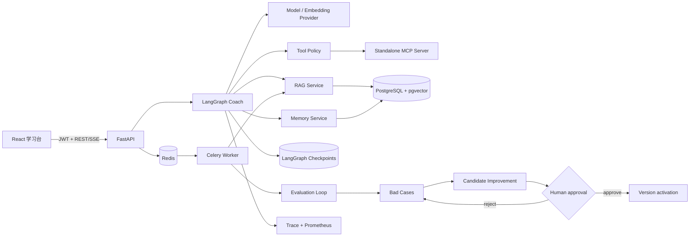

# Margin Notes · 商务英语教练 Agent

一个面向中文母语职场人的、可解释且可评测的商务英语教练。它既是一款能用的学习产品，也是一份生产级 Agent 工程教材：你可以在 UI 中看到任务计划、LangGraph 节点、知识引用、工具轨迹、Token、延迟、失败和记忆写入，而不是只看到一句“AI 正在思考”。


## 导航

- [五分钟启动](#1-五分钟启动)
- [系统全景](#2-系统全景)
- [LangGraph 状态机](#3-langgraph-状态机)
- [记忆与知识库](#4-上下文短期记忆和长期记忆)
- [评测与自进化](#7-golden-set自动评测与人工评测)
- [京东云部署](#14-京东云部署)

项目源于对 AI 应用岗位硬技能的拆解，重点证明以下能力：

- FastAPI API、异步任务、数据库、鉴权、幂等、监控和失败恢复。
- LangGraph 任务规划、状态机、短期/长期记忆与 checkpoint。
- Function Calling 与独立 MCP Server 的实际边界。
- RAG 切分、Embedding、混合检索、引用和检索评测。
- golden set、自动评测、人工评测、bad case 和受控自进化。
- 文本/语音交互、SSE、取消/重试所需的前后端边界。

> 代码中把你原文的 `langgrepe` 按 **LangGraph** 实现。

## 1. 五分钟启动

### 推荐：Docker Compose

需要 Docker Engine 与 Compose Plugin。

```bash
cd business-english-coach
cp .env.example .env
docker compose up --build
```

打开：

- 学习台：<http://localhost>
- OpenAPI：<http://localhost/api/docs>（直接开发运行时是 <http://localhost:8000/api/docs>）
- 健康检查：<http://localhost/api/health>
- Prometheus 指标：<http://localhost/metrics>

在登录页点击“创建并进入本地演示账号”，系统会创建：

- 学员：`learner@example.com` / `learn-english`
- 管理员：`admin@example.com` / `learn-english`

默认 `AI_PROVIDER=mock`、`SPEECH_PROVIDER=mock`。整条状态机、数据库、RAG、评测和轨迹都是真的；只有需要付费的模型/语音响应是确定性 Mock，因此不会上传学习内容。

### 纯本地开发

后端可用 SQLite 运行；知识向量以 JSON 保存，生产 PostgreSQL 自动切换为 pgvector 类型。

```bash
cd business-english-coach/backend
python3 -m venv .venv
source .venv/bin/activate
pip install -e '.[dev]'
mkdir -p data/uploads
DATABASE_URL=sqlite:///./data/coach.db AI_PROVIDER=mock uvicorn app.main:app --reload --port 8000
```

另开终端：

```bash
cd business-english-coach/frontend
npm install
npm run dev
```

Vite 会把 `/api` 与 `/metrics` 代理到 `localhost:8000`。异步上传和批量评测在 Redis/Celery 不可用时会自动走请求内开发回退；生产环境应始终运行 Worker。

## 2. 系统全景



服务职责：

| 服务 | 做什么 | 不做什么 |
|---|---|---|
| React Web | 训练、语音、记忆、知识、评测和轨迹展示 | 不保存密钥，不决定工具权限 |
| FastAPI | 身份、数据隔离、API 契约、上传和审计 | 不把路由逻辑藏进 Prompt |
| LangGraph | 节点、状态、条件流转、checkpoint | 不直接信任模型提出的写操作 |
| PostgreSQL/pgvector | 业务数据、长期记忆、知识向量、运行轨迹 | 不充当临时消息队列 |
| Redis/Celery | 文档入库、批量评测、重试和队列 | 不保存最终事实 |
| MCP Server | 可复用商务术语、公司材料查询、练习日程协议 | 不读取任意文件或绕过用户权限 |

## 3. LangGraph 状态机

主图位于 `backend/app/agent/graph.py`：

```text
START
  ↓
load_context          读取 profile、短期消息、长期记忆
  ↓
understand_request    判断写作/角色扮演/诊断/复习并生成任务计划
  ↓
retrieve_context      Query Embedding + 用户隔离的知识检索
  ↓
coach                 组装可信上下文并调用模型；超时重试
  ↓
assess                用确定性 rubric 生成基础评分和记忆候选
  ↓
persist               原子保存消息，筛选长期记忆，压缩旧上下文
  ↓
END
```

为什么不让一个 ReAct Prompt 包办一切？

1. 检索、权限、写记忆和审计都是确定性责任，不应由模型“自觉遵守”。
2. 每个节点可以独立测试、重试、统计延迟和定位 bad case。
3. 状态机可以在 checkpoint 后恢复，不必重新执行已经成功的副作用。
4. 未来加入邮件、面试或谈判子图时，不需要不断膨胀系统 Prompt。

`CoachState` 是节点间唯一的数据合同。模型输出不能直接修改数据库；它最多提供候选，领域服务再次验证后才写入。

### Checkpoint 和失败恢复

- PostgreSQL 使用 `AsyncPostgresSaver`，`conversation_id` 是 LangGraph `thread_id`。
- SQLite 开发使用进程内 saver；消息历史仍持久化到应用表。
- 模型调用有超时、有限指数退避和重试轨迹，达到上限后把 run 标记为 failed。
- 写入动作依靠唯一键或业务幂等逻辑，重放不能生成重复记忆。
- 原始消息永不因上下文压缩而消失；摘要是可重建的派生数据。

## 4. 上下文、短期记忆和长期记忆

这些概念经常被混为一谈：

| 概念 | 生命周期 | 当前实现 | 典型内容 |
|---|---|---|---|
| Context | 一次模型请求 | 系统指令、当前输入、精选消息、检索片段 | “这一次模型能看到什么” |
| Short-term memory | 一个 conversation/thread | 最近 12 条消息、上下文摘要、LangGraph checkpoint | 当前角色扮演进行到哪一步 |
| Long-term memory | 跨会话 | `long_term_memories` + learner profile | 岗位、目标、反复出现的错误、复习时间 |
| Knowledge base | 多用户可共享或私有 | document/chunk + pgvector | 商务教材、公司术语与写作规范 |

长期记忆分四类：

- `profile`：行业、岗位、目标等稳定事实。
- `mastery`：某个语法、语气或场景的掌握度。
- `episode`：一次值得复用的错误或成功表达。
- `learning_plan`：复习项和下一次复习时间。

记忆使用 `(user_id, memory_type, canonical_key)` 去重。低置信度的新证据不会覆盖高置信度事实；每条记忆保留来源、置信度、复习时间和启用状态。学员只能访问自己的记忆，并可在 UI 中查看和修改。

## 5. RAG：从文件到可引用回答

上传支持 Markdown、TXT、PDF，默认最大 10 MB：

```text
validate → store with generated filename → extract text → paragraph-aware chunks
→ embed → index → ready
```

安全细节：

- 不信任原始 filename，磁盘名称由 UUID 生成，阻断目录穿越。
- 文档文本在 Prompt 中标为不可信参考，不能覆盖系统指令。
- 所有查询同时过滤 `public document OR current user owns document`。
- 引用格式为 `[Document title · §chunk-number]`，可映射回原切片。

检索层实现可测试的 lexical + semantic fusion。SQLite 演示在应用层计算；PostgreSQL 的 embedding 列使用 pgvector。生产数据量变大后，应把候选召回下推为 pgvector cosine 距离和 PostgreSQL FTS，再对 Top-N 进行同样的融合/重排。这样接口和评测集不用变化。

建议重点观察：Recall@K、MRR、nDCG、引用正确率、groundedness。回答差不一定是模型差：也可能是解析失败、切分错误、Query Rewrite 偏离、metadata filter 过严或召回候选不足。

## 6. Function Calling 与 MCP

二者不是互斥技术：

- Function Calling 是模型表达“我要调用某个函数及参数”的模型接口能力。
- 工具注册表负责权限、参数、超时、确认、重试和审计。
- MCP 是 Agent 与外部工具/资源服务之间的标准协议，提供发现、初始化、调用和返回内容的生命周期。

应用内 `search_knowledge` 适合普通 Function Tool，因为它紧贴本服务数据库与 user scope。独立 MCP Server 暴露：

- `business_term_lookup(term)`：查询商务术语和例句。
- `company_material_search(query, materials)`：只搜索调用者已经获权的材料片段。
- `practice_schedule(topic, due_at_iso, confirmed)`：写操作要求明确确认，过去时间会失败。

直接测试 MCP：

```bash
docker compose up mcp api
# 登录取得 ACCESS_TOKEN 后：
curl -X POST http://localhost/api/v1/tools/mcp/business_term_lookup \
  -H "Authorization: Bearer $ACCESS_TOKEN" \
  -H "Content-Type: application/json" \
  -d '{"arguments":{"term":"align"}}'
```

MCP Server 不接收任意路径或 URL，避免把“工具很强”误解成“模型能随便访问宿主机”。

## 7. Golden set、自动评测与人工评测

`evals/golden_set.jsonl` 中每行包含：

```json
{
  "id": "meeting-001",
  "category": "roleplay",
  "level": "B1",
  "input": "...",
  "expected": {"contains_any": ["concern", "could"], "prohibited": ["You are wrong"]},
  "rubric": {"tone": 5, "business_fit": 5},
  "tags": ["meeting", "disagreement"]
}
```

自动评测分层进行：

1. **确定性门禁**：非空、Schema、必须/禁止表达、引用格式、工具与权限路径。
2. **检索指标**：候选片段与证据相关性、Recall@K/MRR/nDCG。
3. **教学质量 rubric**：grammar、vocabulary、tone、clarity、business fit、teaching value。
4. **系统质量**：成功率、首 Token、p50/p95、Token、成本、工具错误率。
5. **人工盲评**：维度分、问题标签、评论和评审一致性。

当前代码交付了确定性 release gate 和人工 review 数据合同。接入真实 evaluator model 时，LLM-as-judge 只能追加分数与理由，不能覆盖确定性安全结果；还应定期用人工标注集检查 judge 偏差。

管理员流程：

```text
POST /evaluations                     运行 golden set
POST /evaluation-results/{id}/reviews 写人工评分
```

低分结果自动进入 `bad_cases`，保存具体 checks 和根因，避免只记录一句“回答不好”。

## 8. 自进化不是“让模型修改自己”

本项目采用受控改进闭环：

```text
真实反馈/评测失败
  → bad case 聚类
  → 候选 Prompt/路由/知识/rubric
  → 新旧版本离线评测
  → 生成差异报告
  → 人工批准
  → 激活候选版本
  → 监控
  → 必要时回滚
```

默认发布门槛：

- 至少积累 10 个 open bad cases 才自动生成候选。
- pass rate 不低于 90%。
- safety cases 必须全部通过。
- 质量至少提升 3 个百分点。
- 延迟和成本回归都不得超过 10%。
- 无论指标多好，都必须由 admin 批准。

API 顺序：

```text
POST /improvements/generate
POST /evaluations  {"candidate_version":"candidate-..."}
POST /improvements/{proposal}/attach-evaluation/{evaluation}
POST /improvements/{proposal}/approve
POST /improvements/rollback
```

激活版本保存在 `system_settings`，回滚交换 current/previous。数据库迁移的 downgrade 故意不删除表：应用版本回退与破坏性数据变更必须分开审批。

## 9. 可观测性：一次回答发生了什么

每个 Agent run 包含：

- `trace_id`、用户/会话、状态、当前节点和 Prompt 版本。
- 输入/输出 Token、估算成本、首 Token 延迟和总延迟。
- retry 次数、错误类型和截断后的安全错误信息。
- 顺序化 node/tool/retry 事件、耗时及脱敏 payload。

Prometheus 指标包括：

- `coach_agent_runs_total{status}`
- `coach_model_tokens_total{direction}`
- `coach_node_duration_seconds{node}`
- `coach_tool_calls_total{tool,status}`

学习台的 Run Observatory 展示相同轨迹。这样开发者、评测员和最终用户谈的是同一次运行，而不是各看一套日志。

生产告警至少应覆盖：5 分钟失败率、p95 延迟、Celery 积压、数据库连接池、磁盘/上传卷、模型限流和证书到期。

## 10. 权限和数据边界

角色：

| Role | 能力 |
|---|---|
| learner | 自己的对话、语音、记忆、知识与 trace |
| evaluator | learner 能力 + golden set 结果和人工评分 |
| admin | evaluator 能力 + 改进候选、发布、回滚和策略 |

安全策略：

- 密码使用 Argon2；Refresh Token 只保存 SHA-256 hash，旋转后旧 token 作废。
- Access JWT 较短，所有资源查询同时检查 ownership，不依赖前端隐藏按钮。
- 工具权限由服务端 registry/policy 决定；模型不能声明自己拥有 scope。
- 写工具要求 confirmation，审计表记录 actor、resource、action 和结果。
- 日志过滤 password/token/api_key；生产必须替换默认 `SECRET_KEY`。
- Prompt Injection 文本作为数据进入 reference 区，不能被拼进 system instruction。

当前演示没有实现邮箱验证、忘记密码、速率限制和 CSRF Cookie 模式；正式公网开放前需要补上。JWT 当前通过 Authorization Header 发送，不放在浏览器 Cookie 中。

## 11. 语音

`SpeechProvider` 统一 STT/TTS：

- Mock STT 返回稳定句子，便于无 Key 演示录音 UI。
- OpenAI 模式使用配置的 transcription/speech 模型。
- 文件大小受 `MAX_UPLOAD_MB` 限制。
- 前端停止录音时主动释放麦克风 track。

首版反馈语言、清晰度和商务表达，不假装提供音素级发音分数。若要做发音评分，应引入专用 forced-alignment/phoneme 服务和独立语音 golden set，而不是让通用 LLM 猜。

## 12. API 快速演练

```bash
# 开发环境创建 demo 用户
curl -X POST http://localhost:8000/api/v1/demo/bootstrap

# 登录
curl -X POST http://localhost:8000/api/v1/auth/login \
  -H 'Content-Type: application/json' \
  -d '{"email":"learner@example.com","password":"learn-english"}'

# 创建会话
curl -X POST http://localhost:8000/api/v1/conversations \
  -H "Authorization: Bearer $ACCESS_TOKEN" \
  -H 'Content-Type: application/json' \
  -d '{"title":"Meeting practice","mode":"roleplay"}'

# 发送消息
curl -X POST http://localhost:8000/api/v1/conversations/$CONVERSATION_ID/messages \
  -H "Authorization: Bearer $ACCESS_TOKEN" \
  -H 'Content-Type: application/json' \
  -d '{"content":"I disagree because launching next week is too risky."}'

# 查看节点轨迹
curl http://localhost:8000/api/v1/runs/$RUN_ID/trace \
  -H "Authorization: Bearer $ACCESS_TOKEN"
```

完整契约以 `/api/docs` 的 OpenAPI 为准。

## 13. 测试与验收

后端：

```bash
cd backend
pytest
ruff check app tests
```

前端：

```bash
cd frontend
npm run build
```

测试覆盖：

- 记忆去重、置信度冲突与跨用户知识隔离。
- LangGraph 全图、意图路由、消息持久化与 trace。
- 密码/JWT 基础逻辑、工具 scope 和人工确认。
- golden set 确定性门禁、bad case、发布 gate 和回滚。
- 混合检索的 lexical/cosine 纯函数。

上线前还应在 CI 中增加 PostgreSQL/pgvector、Redis/Celery 和 MCP 的容器集成测试，以及 Playwright 对登录、练习、上传、语音和观测台的端到端测试。

## 14. 京东云部署

第一版采用京东云 CVM + Docker Compose：Web/API/Worker/MCP 分容器，数据库、Redis 和上传数据放命名卷，只有 Nginx 暴露公网。详见 [`deploy/jdcloud/README.md`](deploy/jdcloud/README.md)。

发布脚本会：

1. 校验 Compose 配置。
2. 构建新镜像。
3. 执行 Alembic upgrade。
4. 原地更新服务并显示健康状态。

它不会清理数据库或删除卷。流量增长后可以迁移到京东云 Kubernetes、RDS、云缓存 Redis 和对象存储；Provider、API 和 Agent graph 不需要因此重写。

## 15. 目录导航

```text
business-english-coach/
├── backend/
│   ├── app/
│   │   ├── agent/          # State、Prompt、LangGraph、checkpoint、tool policy
│   │   ├── mcp_server/     # 独立 MCP Server
│   │   ├── services/       # Provider、RAG、记忆、评测、进化、入库
│   │   ├── main.py         # FastAPI 与公开接口
│   │   └── models.py       # 用户、记忆、知识、trace、评测、改进模型
│   ├── alembic/            # 数据库版本基线
│   ├── data/seed/          # 内置商务英语资料
│   └── tests/
├── frontend/               # React 编辑部工作坊学习台
├── evals/                  # 可版本控制的 golden set
├── deploy/                 # Nginx 与京东云部署
├── docker-compose.yml
└── .env.example
```

## 16. 下一阶段建议

按学习价值排序：

1. 将 Provider 的真实 streaming token 接入 SSE，记录 first-token latency，并实现客户端 AbortController 取消。
2. 在 PostgreSQL 中把候选召回下推到 FTS + pgvector，补 Recall@K/MRR/nDCG 评测脚本。
3. 加一个真实 reranker，并用 golden set 对比“向量检索 / hybrid / hybrid + rerank”。
4. 让 evaluator model 按固定 JSON rubric 评分，再与两位人工评审计算相关性和一致性。
5. 为 Celery 增加死信队列、任务幂等表和运维重放页。
6. 接入 OpenTelemetry Collector，把 API span、LangGraph node 和 MCP call 串成分布式 trace。
7. 增加限流、邮箱验证、密码找回、数据导出与经过明确确认的数据删除流程。

这几步刻意没有藏进第一版：每一项都应该在有 baseline、golden set 和可观察指标之后加入，否则“框架更多”并不等于系统更好。
